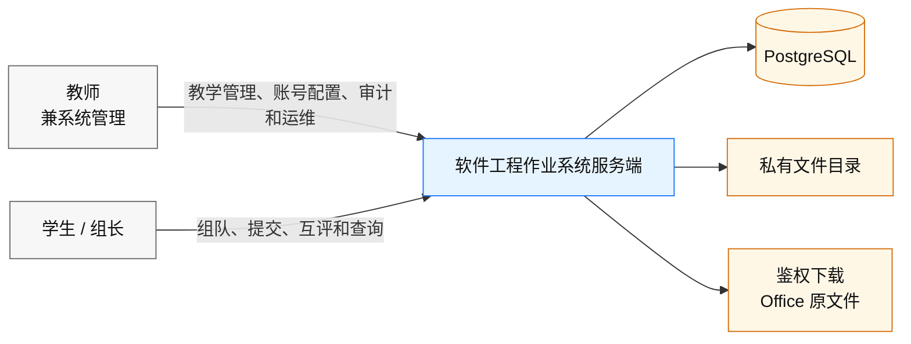
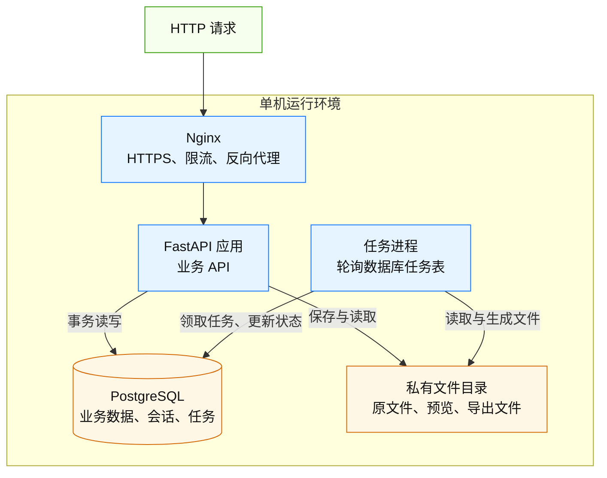
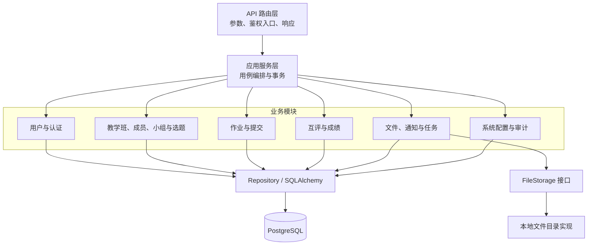
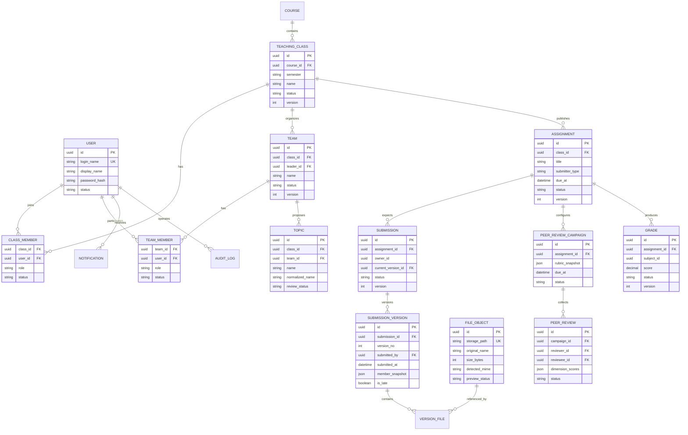
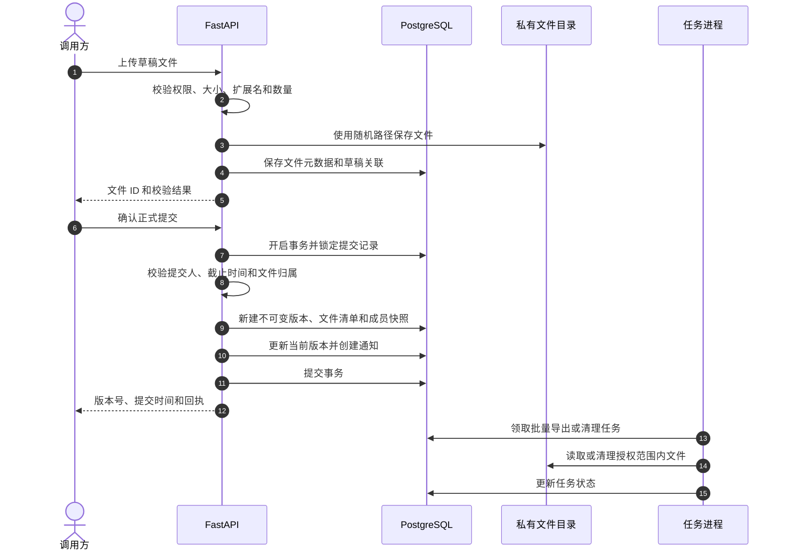

# 软件工程作业系统架构设计

> 文档版本：V1.1  
> 需求基线：`PRD-软件工程作业系统.md` V1.0  
> 设计范围：服务端架构；Web 客户端实现见 `docs/前端架构与原型说明.md`  
> 首版架构：FastAPI 模块化单体 + PostgreSQL + 本地文件存储

## 1. 设计结论

本系统首版采用简单的模块化单体，不采用微服务，也不把 Redis、Celery、MinIO、消息队列或 Kubernetes 作为必需组件。

服务端由一个 FastAPI 应用承载全部业务 API，PostgreSQL 保存业务数据和任务状态，服务器私有目录保存作业文件。批量导出等耗时操作由同一代码库中的轻量任务进程执行。API 与任务进程共享业务代码和数据库，但以不同进程运行。

这一方案满足首版单教学班 200 人、100 个小组的容量，同时保留清晰的替换接口：未来确有容量或高可用需求时，再把本地文件目录替换为对象存储，把数据库任务表替换为专业任务队列。

## 2. 设计原则

1. **优先保证业务正确性**：提交版本、选题占用、成员关系和成绩发布由数据库事务与约束保护。
2. **保持部署简单**：首版只依赖 FastAPI、PostgreSQL 和文件目录。
3. **后端统一鉴权**：首版只有教师和学生两类身份；教学班、小组和提交关系决定具体资源权限。
4. **业务模块清晰**：按业务能力拆分代码，但仍在一个应用、一个仓库和一个数据库中运行。
5. **历史不可覆盖**：正式提交、成员快照、评分修改和关键操作均可追溯。
6. **先解决实际问题**：不为尚未出现的访问量、组织规模或多机部署预先增加分布式组件。

## 3. 系统上下文



### 3.1 系统边界

服务端负责：

- 登录、会话、角色和资源权限。
- 教学班、成员名单和默认账号。
- 小组、申请、邀请、选题和审核。
- 作业规则、草稿、正式提交和历史版本。
- 文件保存、预览状态和授权下载。
- 互评、教师评分、成绩发布和统计导出。
- 站内通知、任务状态和审计日志。

首版只有一名教师，该教师同时承担账号维护、运行配置、失败任务处理和审计查询，不设置独立的系统管理员角色。审计日志仍不可由教师修改或删除。首版不负责统一身份认证、外部消息渠道、Office 在线编辑、教务成绩同步、代码托管和自动化测试。客户端页面、路由和状态管理在 `docs/前端架构与原型说明.md` 中定义；正式 Web 客户端采用 Vue 3 + Ant Design Vue，并通过 Nginx 与服务端组成同源入口。

## 4. 整体部署架构



### 4.1 组件职责

| 组件 | 职责 |
|---|---|
| Nginx | HTTPS 终止、请求大小限制、基础限流、反向代理和文件下载转发 |
| FastAPI | 接口、鉴权、业务规则、事务和文件访问授权 |
| PostgreSQL | 业务事实、会话、幂等记录、任务表和审计日志 |
| 文件目录 | 保存原始附件、派生预览和临时导出；目录不直接暴露公网 |
| 任务进程 | 执行批量导出、截止提醒和过期文件清理 |
| Office 文件 | DOCX/XLSX 不转码，由 API 校验权限后返回原文件下载 |

任务进程不是独立服务，也没有单独业务逻辑。它与 API 使用同一个项目镜像和应用服务，只是启动命令不同。开发环境可暂不启动任务进程，测试时可同步调用任务处理函数。

## 5. 服务端模块



### 5.1 模块职责

| 模块 | 核心职责 |
|---|---|
| 用户与认证 | 登录失败锁定、密码哈希、主动改密、会话、账号状态和角色 |
| 教学班、成员、小组与选题 | 名单导入、邀请码、成员关系、组队流程、容量规则、选题查重与审核 |
| 作业与提交 | 作业规则、草稿区、个人/小组提交、撤回、重交、版本和成员快照 |
| 互评与成绩 | 一对一冻结分配、总分与评语、评价作废、评分草稿、成绩发布与修改历史 |
| 文件、通知与任务 | 文件元数据、上传、预览、导出、站内通知和后台任务 |
| 系统配置与审计 | 教师维护运行配置、处理失败任务并查询不可修改的关键操作记录 |

### 5.2 代码分层

建议目录如下：

```text
app/
  main.py                 # FastAPI 创建、异常处理和路由注册
  api/                    # /api/v1 路由和请求/响应 Schema
  modules/
    identity/
    classes/
    assignments/
    reviews/
    files/
    audit/
  common/                 # 配置、数据库、错误码、鉴权依赖
  tasks/                  # 任务领取与处理入口
  migrations/             # Alembic 迁移
tests/
```

每个模块内部按需要包含 `models.py`、`schemas.py`、`service.py` 和 `repository.py`，不再为了形式拆出过多空目录。

代码边界规则：

- 路由只解析参数、调用应用服务和转换响应，不直接操作 ORM。
- 应用服务定义事务边界并执行完整用例。
- 状态机和核心校验写在模块服务或领域对象中，不能只写在接口层。
- 跨模块写操作调用对方应用服务，不能绕过规则直接修改对方数据表。
- `FileStorage` 只定义保存、读取、删除和生成内部路径等能力；首版实现为本地目录。

## 6. API 与会话约定

### 6.1 API 分组

全部接口使用 `/api/v1` 前缀：

| 路径 | 职责 |
|---|---|
| `/auth` | 登录、退出、改密和当前会话 |
| `/classes` | 教学班、规则、邀请码、归档和工作台摘要 |
| `/members` | 名单预览、确认导入和成员管理 |
| `/teams` | 小组、申请、邀请、成员调整和组长移交 |
| `/topics` | 选题提交、查重和教师审核 |
| `/assignments` | 作业草稿、发布、规则和附件 |
| `/submissions` | 草稿文件、正式提交、撤回、版本和看板 |
| `/files` | 上传、预览状态和授权下载 |
| `/peer-reviews` | 互评配置、评价和异常处理 |
| `/grades` | 评分草稿、成绩预览、发布和修改 |
| `/notifications` | 站内通知和已读状态 |
| `/exports` | 导出任务、进度和结果下载 |
| `/system` | 仅教师可用的账号维护、运行配置、失败任务和审计检索 |

### 6.2 通用规范

- 时间使用 ISO 8601，数据库统一保存 `timestamptz` 和 UTC。
- 列表响应包含 `items`、`page`、`page_size`、`total`，排序最后带唯一主键以保证稳定。
- 并发编辑的资源包含 `version` 字段；旧版本更新返回 HTTP 409。
- 创建和正式提交接受 `Idempotency-Key`，避免重复点击产生重复数据。
- 后台任务返回 HTTP 202 和 `job_id`，任务状态为 `PENDING`、`RUNNING`、`SUCCEEDED` 或 `FAILED`。
- OpenAPI 是接口契约来源，客户端如何生成或消费接口不在本文约束范围内。

统一错误响应：

```json
{
  "code": "SUBMISSION_VERSION_CONFLICT",
  "message": "提交状态已变化，请刷新后重试",
  "details": {
    "current_version": 3
  },
  "request_id": "01J..."
}
```

错误不得泄露其他小组信息、数据库细节、服务器文件路径或异常堆栈。

### 6.3 会话与权限

- 密码使用 Argon2id 加盐哈希，不记录明文。
- Cookie 保存随机会话 ID，并设置 `HttpOnly`、`Secure` 和 `SameSite=Lax`。
- 会话记录保存在 PostgreSQL，包含用户、过期时间、认证版本和撤销时间。
- 修改密码、教师重置密码、账号禁用和退出登录后，相关会话立即失效。
- 连续 5 次登录失败后限制 15 分钟，并结合账号和来源 IP 控制，避免校园网共用 IP 造成大面积误伤。
- 写请求校验 CSRF Token。
- 首版业务身份只有 `TEACHER` 和 `STUDENT`；组长是小组成员关系中的职责，不是全局角色。
- `TEACHER` 同时拥有课程教学和系统管理能力；只有一名教师时不再细分管理员角色。
- 权限检查先判断教师或学生身份，再校验教学班归属、小组关系、提交主体或评价关系。
- 数据模型可保留通用角色枚举或权限扩展点，但首版不得创建无实际用途的管理员账号和角色管理界面。
- 教学班归档后，统一权限依赖拒绝所有业务写请求。

## 7. 数据架构



ER 图只展示核心对象。申请邀请、会话、导入任务、后台任务、评分明细和审计日志等表在数据库详细设计阶段补充。

### 7.1 数据库必须保证的约束

| 业务规则 | 实现方式 |
|---|---|
| 学生在同一教学班只能加入一个有效小组 | 有效小组成员关系的部分唯一索引 |
| 小组名称在教学班内唯一 | `UNIQUE(class_id, normalized_name)` |
| 同一教学班有效选题不重复 | 对有效状态建立 `UNIQUE(class_id, normalized_name)` |
| 提交版本号不重复 | `UNIQUE(submission_id, version_no)` |
| 同一活动不能重复评价同一成员 | `UNIQUE(campaign_id, reviewer_id, reviewee_id)` |
| 小组提交和个人提交主体不可混用 | `CHECK` 约束提交主体类型和所有者字段 |

自评、跨组评价、组长权限、截止时间和教学班归档涉及多张表，由应用服务在事务内校验。

## 8. 正式提交流程



### 8.1 提交事务规则

1. 锁定提交记录；首次提交依靠唯一键防止并发创建两条记录。
2. 在事务内重新读取教学班、作业时间、迟交规则和操作者身份。
3. 检查文件已完整保存且属于当前提交草稿区。
4. 创建不可变版本、文件清单和成员快照。
5. 更新当前版本指针，写入审计日志和后台任务。
6. 事务提交后返回回执；预览是否成功不影响正式提交。

撤回只修改提交状态，不删除历史版本。重新提交总是生成新版本，教师默认查看最新有效版本并可查询历史。

## 9. 轻量后台任务

### 9.1 任务表

PostgreSQL 中设置通用 `background_job` 表：

| 字段 | 说明 |
|---|---|
| `id` | 任务 ID |
| `type` | `FILE_PREVIEW`、`EXPORT`、`NOTIFY`、`CLEANUP` 等 |
| `payload` | JSON 参数，只存业务 ID，不存文件内容 |
| `status` | `PENDING`、`RUNNING`、`SUCCEEDED`、`FAILED` |
| `attempts` | 已尝试次数 |
| `available_at` | 下次可执行时间 |
| `locked_at` | 领取时间，用于超时恢复 |
| `last_error` | 清洗后的错误摘要 |

任务进程使用 `SELECT ... FOR UPDATE SKIP LOCKED` 领取任务。任务处理必须幂等；失败采用有限次数的延迟重试，超过上限后保留失败状态供教师查看。API 在业务事务内同时写业务数据和任务记录，因此不需要额外 Outbox 或消息队列。

### 9.2 周期任务

任务进程在固定间隔执行以下扫描：

- 创建临近截止的站内提醒。
- 清理上传失败或长期未关联的临时文件。
- 恢复因进程退出而长时间保持 `RUNNING` 的任务。
- 清理过期导出文件和过期会话。

单机首版只运行一个任务进程。未来运行多个进程时，数据库行锁仍能防止同一任务同时被领取。

## 10. 文件处理与安全

- 上传请求经过 FastAPI，以流式方式写入临时文件；完成大小和 MIME 检查后再原子移动到正式目录。
- 文件路径使用随机 ID 分层组织，原始文件名只存数据库，不参与服务器路径拼接。
- 数据库只保存相对存储路径，根目录由配置提供，避免迁移服务器时修改数据。
- 文件目录不由 Nginx 公开映射；下载先经过 API 授权，再使用 Nginx 内部转发或流式响应。
- Markdown 使用白名单清洗，禁止脚本、事件属性和危险链接。
- PDF 和图片可直接预览；Markdown 转为 HTML 后清洗；DOCX/XLSX 不转码，只提供鉴权后的原文件下载。
- 转码失败记录安全原因并允许下载原文件，不阻断提交。
- 文件元数据写入失败时删除临时文件；文件删除任务失败时可由定期一致性扫描再次处理。

## 11. 并发与失败处理

| 场景 | 处理方式 |
|---|---|
| 多个入组申请同时获批 | 锁定教学班成员记录；唯一约束保证只加入一个组，其余申请失效 |
| 最后一个小组名额被并发审批 | 锁定小组并重新统计有效成员，超出上限的事务回滚 |
| 两组提交等价选题 | 规范化名称后由唯一索引裁决；错误不泄露已占用题目 |
| 截止时间附近提交 | 使用数据库当前时间，并在锁内重新读取迟交规则 |
| 重复点击正式提交 | 幂等键返回第一次结果，版本唯一约束提供第二层保护 |
| 文件上传中断 | 临时文件不建立正式记录，由周期任务清理 |
| 任务进程异常退出 | 超时后将任务恢复为待处理；任务函数按业务 ID 幂等执行 |
| Office 文件访问 | 不执行转码，API 校验权限后返回原文件下载 |
| 成绩发布并发修改 | 资源版本检查和事务锁防止部分发布或覆盖 |
| 归档后旧请求写入 | 服务端统一归档门禁拒绝写操作 |

## 12. 日志、备份与运维

### 12.1 日志与审计

- FastAPI 和任务进程输出 JSON 日志，包含时间、级别、`request_id`、用户、教学班、动作和耗时。
- Nginx 生成或透传 `X-Request-ID`，API 将其写入响应和审计记录。
- 日志不得记录密码、Cookie、CSRF Token、完整评语、文件内容或服务器绝对路径。
- 正式提交、撤回、成员调整、成绩修改和评价作废写入独立审计表，记录操作者、对象、关键前后值、原因、IP 和时间。

### 12.2 健康检查

| 接口 | 检查内容 |
|---|---|
| `/health/live` | FastAPI 进程是否存活 |
| `/health/ready` | PostgreSQL、文件目录和迁移版本是否可用 |

最低监控项包括 API 错误率和响应时间、数据库连接数、磁盘剩余空间、失败任务数量、预览失败率和最近备份结果。

### 12.3 备份恢复

- 每日备份 PostgreSQL 和文件目录，使用相同批次号记录两者对应关系。
- 备份保存到与应用数据盘不同的位置。
- 每学期至少做一次恢复演练，检查用户、提交版本、文件和成绩引用一致性。
- 教学班归档后保持只读；达到保留年限后的删除必须审批并记录审计。

## 13. 部署建议

本地开发默认仅通过 Docker Compose 运行 PostgreSQL；FastAPI、任务进程和 Vue/Vite 在宿主机运行：

```text
Docker: PostgreSQL 容器 5432 -> 本机 5433
本地:  FastAPI:8000 + task-runner + Vite:8080
```

自动化测试使用 `test` profile 启动独立的 `coursework_test` 数据库、API 和前端，测试数据库使用临时文件系统且不映射宿主端口，不读写开发数据；需要排查容器部署时，可使用 `container-app` profile 启动 Nginx、API、任务进程和 PostgreSQL。`api` 和 `task-runner` 使用同一个应用镜像并挂载同一个私有文件卷。

生产环境在单台 Linux 服务器直接部署，不依赖 Docker：Nginx 托管 Vue 3 构建产物并反向代理 FastAPI；API 和任务进程由 systemd 分别托管；PostgreSQL 和私有文件目录使用服务器持久化路径。具体步骤见 `docs/服务器直接部署说明.md`。

部署约束：

- 配置通过环境变量或 Secret 注入，不把密码提交到仓库。
- Alembic 迁移由一次性命令执行，成功后再启动新版本。
- 数据库、文件和备份使用独立持久目录。
- Nginx 设置请求体上限和上传超时，API 使用流式上传避免把整个文件读入内存。
- 发布使用版本化镜像，升级前执行数据库和文件备份。

## 14. 需求覆盖

| PRD 功能 | 负责模块 | 关键保障 |
|---|---|---|
| F-01 | 用户与认证 | 密码哈希、失败锁定、数据库会话和撤销 |
| F-02 至 F-04 | 教学班与成员 | 唯一邀请码、名单预览确认和摘要查询 |
| F-05 至 F-13 | 小组与选题 | 事务锁、容量校验、唯一关系和选题审核 |
| F-14 至 F-19 | 作业与提交 | 状态机、权限、不可变版本和成员快照 |
| F-20 至 F-21 | 文件与任务 | 后台打包、安全预览和失败降级 |
| F-22 至 F-26 | 互评与成绩 | 一对一分配冻结、总分校验、结果统计、原子发布和修改历史 |
| F-27 至 F-28 | 通知与任务 | 数据库任务、站内通知和异步导出 |
| F-29 | 系统配置与审计 | 教师可查询、不可修改的审计记录和请求追踪 |

## 15. 验收重点

1. 同一学生的多个入组申请并发获批时，最多一个成功。
2. 小组不设置人数上限，可在组队截止时间前继续接收成员。
3. 组员可上传小组草稿，但只有组长可以正式提交、撤回和重交。
4. 正式提交生成不可变版本；撤回 V1 后提交 V2 仍可查看 V1。
5. 截止时只有草稿的提交主体在看板中显示为未提交。
6. 选题规范化后唯一，冲突响应不泄露其他小组题目。
7. 互评禁止自评或更换分配对象；每名参与者恰好一进一出，同一分配只能有一份有效评价。
8. 文件 URL 无法绕过服务端权限；Markdown 危险内容不能执行。
9. Office 文件不经过转码，未经授权不能下载原文件。
10. 教学班归档后所有业务写接口均拒绝操作。
11. 任务进程重复执行或重启不会重复创建通知、预览或导出结果。
12. 从备份恢复后，提交版本、文件和成绩引用完整。

## 16. 后续扩展触发条件

以下组件不在首版引入。只有出现对应问题并经监控确认后才升级：

| 现象 | 可选升级 |
|---|---|
| 多台 API 实例需要共享高频会话或限流 | 引入 Redis |
| 数据库存储任务成为明显瓶颈或任务需要跨机器调度 | 引入 Celery 和 Redis/RabbitMQ |
| 单机磁盘容量、备份或多机共享成为瓶颈 | 将 `FileStorage` 实现替换为 MinIO/S3 |
| PostgreSQL 查询无法满足复杂全文检索 | 评估专用搜索引擎 |
| 单台服务器无法达到可用性目标 | 拆分数据库和文件存储，部署多副本 API |

在上述问题出现前，不引入微服务、Kubernetes、分布式事务或额外基础设施。

## 17. 参考资料

- 产品需求：仓库根目录 `PRD-软件工程作业系统.md`
- FastAPI 大型应用拆分：<https://fastapi.tiangolo.com/tutorial/bigger-applications/>
- FastAPI 后台任务：<https://fastapi.tiangolo.com/tutorial/background-tasks/>
- PostgreSQL：<https://www.postgresql.org/docs/>
